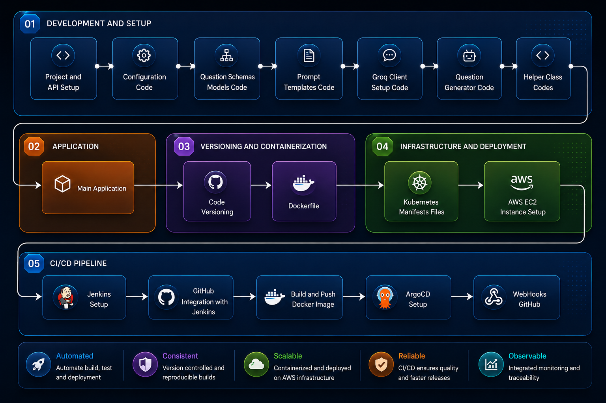

<h1 align="center">📚 Study Buddy AI</h1>

<p align="center">
  <em>An AI-powered quiz generation platform with a production-grade GitOps deployment pipeline.</em>
</p>

<p align="center">
  
  
  
  
  
  
  
  
  
</p>

<p align="center">
  <a href="https://github.com/Anand-Velpuri/Study-Buddy-AI">
    
  </a>
  <a href="https://hub.docker.com/repository/docker/anandvelpuri/studybuddyai/general">
    
  </a>
</p>

---

## 📖 Overview

**Study Buddy AI** generates interactive quizzes on any topic using Large Language Models. Users select a topic, difficulty level, question type (Multiple Choice or Fill in the Blank), and the number of questions — then the app generates, presents, evaluates, and scores the quiz in real time.

Beyond the AI layer, this project is a case study in **building production-ready infrastructure**: the application is containerized with Docker, orchestrated with Kubernetes on AWS EC2, and deployed through a fully automated **GitOps CI/CD pipeline** using Jenkins and ArgoCD.

---

## 🏗️ Architecture

<p align="center">
  
</p>

The architecture spans five layers:

| Layer | Description |
|-------|-------------|
| **01 — Development & Setup** | Project scaffolding, configuration, Pydantic schemas, prompt templates, Groq client, question generator, and helper utilities |
| **02 — Application** | Streamlit-based interactive UI with session-state-driven quiz flow |
| **03 — Versioning & Containerization** | Git version control and Docker image packaging |
| **04 — Infrastructure & Deployment** | Kubernetes manifests (Deployment + Service) running on AWS EC2 |
| **05 — CI/CD Pipeline** | Jenkins (CI) → DockerHub → ArgoCD (CD) with GitHub webhook integration |

---

## ✨ Key Features

- **🧠 Batched LLM Generation** — Generates all questions in a **single LLM call** using Pydantic-validated schemas (`MCQQuizSuite`, `FillBlankQuizSuite`), eliminating sequential per-question API calls
- **🛡️ Structured Output Guardrails** — Strict Pydantic schemas act as guardrails against AI hallucinations, ensuring consistent and valid quiz structures
- **📝 Dual Question Types** — Supports Multiple Choice (4 options) and Fill in the Blank questions
- **🎯 Configurable Difficulty** — Easy, Medium, and Hard difficulty levels
- **📊 Instant Evaluation & Scoring** — Real-time answer checking with detailed results breakdown
- **💾 Export Results** — Save and download quiz results as CSV
- **🔄 Retry Mechanism** — Built-in retry logic (configurable `MAX_RETRIES`) with structured logging for robust generation
- **🚀 Production-Grade Deployment** — Full GitOps pipeline with Docker, Kubernetes, Jenkins, and ArgoCD

---

## 🛠️ Tech Stack

| Category | Technology |
|----------|------------|
| **Language** | Python 3.10 |
| **LLM Provider** | [Groq](https://groq.com/) (Llama 3.1 8B Instant) |
| **LLM Framework** | [LangChain](https://www.langchain.com/) + Pydantic output parsing |
| **Frontend** | [Streamlit](https://streamlit.io/) |
| **Containerization** | Docker |
| **Orchestration** | Kubernetes (Minikube on EC2) |
| **CI** | Jenkins |
| **CD** | ArgoCD |
| **Cloud** | AWS EC2 |
| **Registry** | DockerHub |

---

## 📁 Project Structure

```
Study-Buddy-AI/
├── application.py                  # Main Streamlit application entry point
├── setup.py                        # Python package configuration
├── requirements.txt                # Python dependencies
├── Dockerfile                      # Container image definition
├── Jenkinsfile                     # CI/CD pipeline definition
├── .env                            # Environment variables (GROQ_API_KEY)
│
├── src/                            # Core application source code
│   ├── config/
│   │   └── settings.py             # App settings (API key, model, temperature, retries)
│   ├── models/
│   │   └── question_schemas.py     # Pydantic schemas: MCQQuestion, FillBlankQuestion, *QuizSuite
│   ├── prompts/
│   │   └── templates.py            # LangChain PromptTemplates for quiz generation
│   ├── llm/
│   │   └── groq_client.py          # Groq LLM client factory
│   ├── generator/
│   │   └── question_generator.py   # QuestionGenerator class with retry logic
│   ├── utils/
│   │   └── helpers.py              # QuizManager class (quiz flow, evaluation, CSV export)
│   └── common/
│       ├── logger.py               # Logging configuration
│       └── custom_exception.py     # Custom exception with traceback details
│
├── k8s/                            # Kubernetes manifests
│   ├── deployment.yaml             # Deployment (2 replicas, secret-based env vars)
│   └── service.yaml                # NodePort Service (port 80 → 8501)
│
├── images/                         # Architecture diagrams
│   └── StudyBuddyAI-Architecture.png
│
├── logs/                           # Application logs (auto-generated)
└── results/                        # Saved quiz results CSVs (auto-generated)
```

---

## 🚀 Getting Started

### Prerequisites

- Python 3.10+
- A [Groq API Key](https://console.groq.com/)
- Docker (optional, for containerized deployment)

### 1. Clone the Repository

```bash
git clone https://github.com/Anand-Velpuri/Study-Buddy-AI.git
cd Study-Buddy-AI
```

### 2. Set Up Environment

```bash
python -m venv venv
source venv/bin/activate        # On Windows: venv\Scripts\activate
```

### 3. Install Dependencies

```bash
pip install -e .
```

> This installs all dependencies from `requirements.txt` via `setup.py`, including: `langchain`, `langchain-groq`, `pandas`, `streamlit`, and `python-dotenv`.

### 4. Configure Environment Variables

Create a `.env` file in the project root:

```env
GROQ_API_KEY=your_groq_api_key_here
```

### 5. Run the Application

```bash
streamlit run application.py
```

The app will be available at `http://localhost:8501`.

---

## 🐳 Docker

### Build the Image

```bash
docker build -t studybuddyai .
```

### Run the Container

```bash
docker run -p 8501:8501 -e GROQ_API_KEY=your_key_here studybuddyai
```

---

## ☸️ Kubernetes Deployment

The application is deployed on a Kubernetes cluster running on an **AWS EC2 instance** with the following manifests:

**Deployment** (`k8s/deployment.yaml`):
- **2 replicas** for high availability
- Pulls the image from `anandvelpuri/studybuddyai:<tag>`
- `GROQ_API_KEY` injected via Kubernetes Secret (`groq-api-secret`)

**Service** (`k8s/service.yaml`):
- **NodePort** service exposing port 80 → container port 8501

### Deploy to Kubernetes

```bash
# Create the API key secret
kubectl create secret generic groq-api-secret --from-literal=GROQ_API_KEY=your_key_here

# Apply manifests
kubectl apply -f k8s/
```

---

## 🔄 CI/CD Pipeline — GitOps Workflow

The project uses a complete **GitOps** workflow combining Jenkins (CI) and ArgoCD (CD):

```
 Developer Push → GitHub Webhook → Jenkins Pipeline → DockerHub → Git Commit (k8s/) → ArgoCD Sync → Kubernetes
```

### Jenkins CI Pipeline (Jenkinsfile)

The Jenkins pipeline executes the following stages:

| Stage | Action |
|-------|--------|
| **Checkout** | Pulls latest code from `main` branch |
| **Build Docker Image** | Builds the image tagged as `v<BUILD_NUMBER>` |
| **Push to DockerHub** | Pushes to `anandvelpuri/studybuddyai` |
| **Update Deployment YAML** | Updates the image tag in `k8s/deployment.yaml` via `sed` |
| **Commit Updated YAML** | Commits and pushes the updated manifest back to GitHub |
| **Install CLI Tools** | Installs `kubectl` and `argocd` CLI |
| **ArgoCD Sync** | Triggers ArgoCD to sync the `study` application |

### Solving the GitOps Infinite Loop

A classic problem in GitOps: *Jenkins pushes a manifest update → GitHub triggers Jenkins again → infinite loop*.

**Solution:** Path-based filtering in the `Jenkinsfile`:

```groovy
when {
    not {
        changeset "k8s/**"
    }
}
```

This ensures that commits touching **only** `k8s/` files (manifest updates from Jenkins) are **skipped**, while application code changes proceed through the full pipeline. ArgoCD then independently detects the manifest changes and syncs the cluster.

### ArgoCD CD

ArgoCD continuously polls the repository and reconciles the desired state (in `k8s/`) with the live cluster state, providing:
- **Automated sync** on manifest changes
- **Drift detection** and self-healing
- **Declarative, Git-as-source-of-truth** deployments

---

## 🧠 How It Works — Under the Hood

### Quiz Generation Flow

```
User Input → PromptTemplate → Groq LLM (single call) → PydanticOutputParser → Validated QuizSuite → UI Rendering
```

1. **User configures** the quiz via Streamlit sidebar (topic, type, difficulty, count)
2. **`QuestionGenerator`** selects the appropriate `PromptTemplate` and `PydanticOutputParser` based on question type
3. **A single LLM call** is made to Groq's Llama 3.1 8B, generating all questions at once
4. **Pydantic schemas** (`MCQQuizSuite` / `FillBlankQuizSuite`) validate and structure the response
5. **`QuizManager`** renders the quiz, tracks answers via `st.session_state`, evaluates results, and supports CSV export

### Why Pydantic Batching?

| Approach | LLM Calls (5 questions) | Latency | Token Efficiency |
|----------|------------------------|---------|------------------|
| Sequential (naive) | 5 | High | Low (repeated context) |
| **Batched with Pydantic** | **1** | **Low** | **High** |

### Streamlit State Management

Streamlit's top-to-bottom re-execution model creates state challenges. This project solves them by:
- **Keyed widgets** (`key=f"mcq_{i}"`) — Streamlit auto-persists selections to `st.session_state`
- **Direct state reads** — `evaluate_quiz()` reads answers from `st.session_state`, never local variables
- **Controlled reruns** — A `rerun_trigger` toggle ensures clean state transitions between generation, quiz-taking, and evaluation phases

---

## ⚙️ Configuration

All application settings are centralized in [`src/config/settings.py`](src/config/settings.py):

| Parameter | Default | Description |
|-----------|---------|-------------|
| `GROQ_API_KEY` | From `.env` | Groq API authentication key |
| `MODEL_NAME` | `llama-3.1-8b-instant` | LLM model identifier |
| `TEMPERATURE` | `0.9` | Controls response randomness (0.0 – 1.0) |
| `MAX_RETRIES` | `3` | Max retry attempts for failed LLM calls |

---

## 📄 License

This project is open source and available under the [MIT License](LICENSE).

---

## 🤝 Contributing

Contributions, issues, and feature requests are welcome! Feel free to check the [issues page](https://github.com/Anand-Velpuri/Study-Buddy-AI/issues).

---

## 👤 Author

**Anand Velpuri**

- GitHub: [@Anand-Velpuri](https://github.com/Anand-Velpuri)
- Email: velpurianand8005@gmail.com

---

<p align="center">
  <em>Built with ❤️ and a lot of YAML debugging.</em>
</p>
